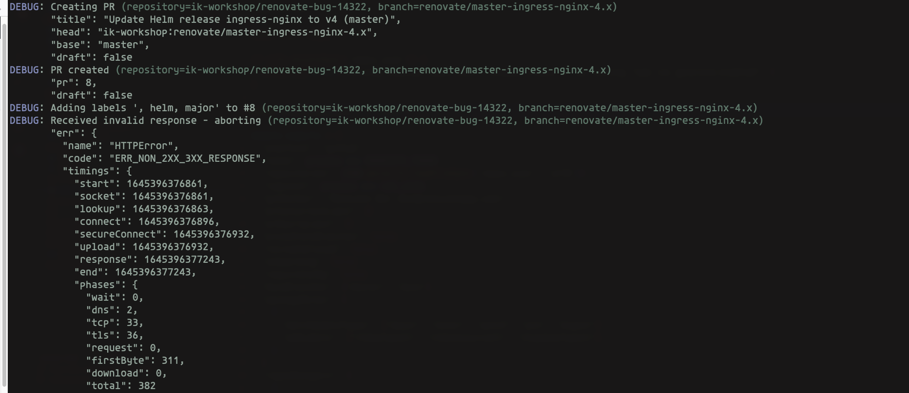
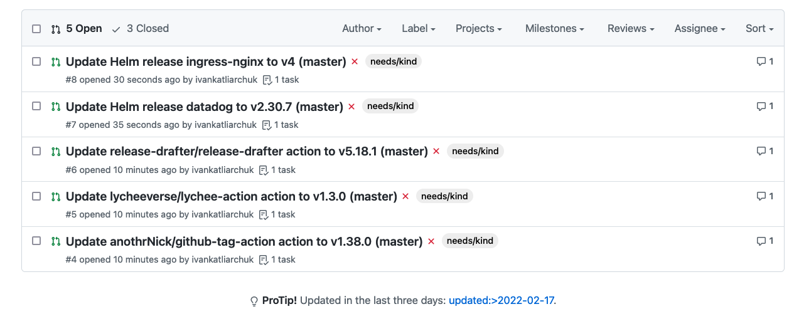
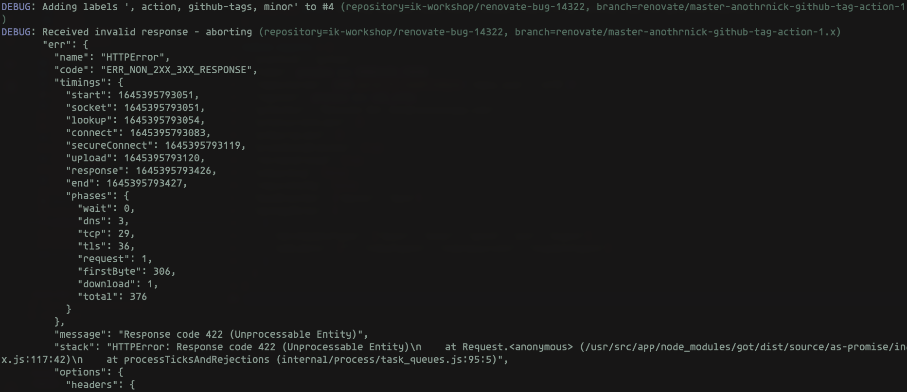

# Renovate Bug Fix

Labels not set when there is an empty label. The renovate congiration does not validate user input, or runtime label setup.
Github API does not let to push empty labels. Renovate can have a behaviour changed slightly.

- [Issue](https://github.com/renovatebot/renovate/issues/14328)
- [Bug fix](https://github.com/renovatebot/renovate/pull/14322)
- [Proposal: is.nonEmptyStringOrWhitespace](https://github.com/sindresorhus/is/issues/158)

---


[](https://github.com/ivankatliarchuk/.github/LICENCE)
[](https://github.com/ik-workshop/renovate-bug-14322)
[](https://github.com/ik-workshop/renovate-bug-14322)


---

[![governance][governance-badge]][governance-action]
[![governance.link-checker][governance.link-checker.badge]][governance.link-checker.status]

---

<!-- START doctoc generated TOC please keep comment here to allow auto update -->
<!-- DON'T EDIT THIS SECTION, INSTEAD RE-RUN doctoc TO UPDATE -->
## Contents

- [Example](#example)
  - [Example 1](#example-1)
  - [Example 2](#example-2)
  - [Example 3](#example-3)
- [How to run](#how-to-run)
- [Create](#create)
- [Resources](#resources)

<!-- END doctoc generated TOC please keep comment here to allow auto update -->

---

## Example

### Example 1

DepType not available. It can be mitiged with more complex configuration.

> depType: The dependency type (if extracted - manager-dependent)

```sh
make example1
```

- [Renovate config](./config-ex1.js)

Error, when `{{depType}}` is not awailable at runtime.

```
DEBUG: Creating PR (repository=ik-workshop/renovate-bug-14322, branch=renovate/master-ingress-nginx-4.x)
       "title": "Update Helm release ingress-nginx to v4 (master)",
       "head": "ik-workshop:renovate/master-ingress-nginx-4.x",
       "base": "master",
       "draft": false
DEBUG: PR created (repository=ik-workshop/renovate-bug-14322, branch=renovate/master-ingress-nginx-4.x)
       "pr": 8,
       "draft": false
DEBUG: Adding labels ', helm, major' to #8 (repository=ik-workshop/renovate-bug-14322, branch=renovate/master-ingress-nginx-4.x)
DEBUG: Received invalid response - aborting (repository=ik-workshop/renovate-bug-14322, branch=renovate/master-ingress-nginx-4.x)
       "err": {
         "name": "HTTPError",
         "code": "ERR_NON_2XX_3XX_RESPONSE",
         "timings": {
           "start": 1645396376861,
           "socket": 1645396376861,
           "lookup": 1645396376863,
           "connect": 1645396376896,
           "secureConnect": 1645396376932,
           "upload": 1645396376932,
           "response": 1645396377243,
           "end": 1645396377243,
           "phases": {
             "wait": 0,
             "dns": 2,
             "tcp": 33,
             "tls": 36,
             "request": 0,
             "firstByte": 311,
             "download": 0,
             "total": 382
           }
         },
         "message": "Response code 422 (Unprocessable Entity)",
         "stack": "HTTPError: Response code 422 (Unprocessable Entity)\n    at Request.<anonymous> (/usr/src/app/node_modules/got/dist/source/as-promise/index.js:117:42)\n    at runMicrotasks (<anonymous>)\n    at processTicksAndRejections (internal/process/task_queues.js:95:5)",
         "options": {
           "headers": {
             "user-agent": "RenovateBot/31.89.4 (https://github.com/renovatebot/renovate)",
             "accept": "application/vnd.github.v3+json",
             "authorization": "***********",
             "content-type": "application/json",
             "content-length": "19",
             "accept-encoding": "gzip, deflate, br"
           },
           "url": "https://api.github.com/repos/ik-workshop/renovate-bug-14322/issues/8/labels",
           "hostType": "github",
           "username": "",
           "password": "",
           "method": "POST",
           "http2": false
         },
         "response": {
           "statusCode": 422,
           "statusMessage": "Unprocessable Entity",
           "body": {
             "message": "Validation Failed",
             "errors": [
               {"value": "", "resource": "Label", "field": "name", "code": "invalid"}
             ],
             "documentation_url": "https://docs.github.com/rest/reference/issues#add-labels-to-an-issue"
           },
           "headers": {
             "server": "GitHub.com",
             "date": "Sun, 20 Feb 2022 22:32:57 GMT",
             "content-type": "application/json; charset=utf-8",
             "content-length": "197",
             "x-oauth-scopes": "repo, workflow",
             "x-accepted-oauth-scopes": "",
             "github-authentication-token-expiration": "2022-03-12 09:39:59 UTC",
             "x-github-media-type": "github.v3; format=json",
             "x-ratelimit-limit": "5000",
             "x-ratelimit-remaining": "4919",
             "x-ratelimit-reset": "1645398330",
             "x-ratelimit-used": "81",
             "x-ratelimit-resource": "core",
             "access-control-expose-headers": "ETag, Link, Location, Retry-After, X-GitHub-OTP, X-RateLimit-Limit, X-RateLimit-Remaining, X-RateLimit-Used, X-RateLimit-Resource, X-RateLimit-Reset, X-OAuth-Scopes, X-Accepted-OAuth-Scopes, X-Poll-Interval, X-GitHub-Media-Type, X-GitHub-SSO, X-GitHub-Request-Id, Deprecation, Sunset",
             "access-control-allow-origin": "*",
             "strict-transport-security": "max-age=31536000; includeSubdomains; preload",
             "x-frame-options": "deny",
             "x-content-type-options": "nosniff",
             "x-xss-protection": "0",
             "referrer-policy": "origin-when-cross-origin, strict-origin-when-cross-origin",
             "content-security-policy": "default-src 'none'",
             "vary": "Accept-Encoding, Accept, X-Requested-With",
             "x-github-request-id": "C462:6FE8:C90507:CC1129:6212C199",
             "connection": "close"
           },
           "httpVersion": "1.1"
         }
       }
DEBUG: Pull request creation error (repository=ik-workshop/renovate-bug-14322, branch=renovate/master-ingress-nginx-4.x)
       "err": {
         "message": "repository-changed",
         "stack": "Error: repository-changed\n    at handleGotError (/usr/src/app/node_modules/renovate/lib/util/http/github.ts:132:14)\n    at GithubHttp.request (/usr/src/app/node_modules/renovate/lib/util/http/github.ts:329:13)\n    at runMicrotasks (<anonymous>)\n    at processTicksAndRejections (internal/process/task_queues.js:95:5)\n    at GithubHttp.requestJson (/usr/src/app/node_modules/renovate/lib/util/http/index.ts:238:17)\n    at addLabels (/usr/src/app/node_modules/renovate/lib/platform/github/index.ts:1259:5)\n    at Proxy.createPr (/usr/src/app/node_modules/renovate/lib/platform/github/index.ts:1518:3)\n    at ensurePr (/usr/src/app/node_modules/renovate/lib/workers/pr/index.ts:441:14)\n    at processBranch (/usr/src/app/node_modules/renovate/lib/workers/branch/index.ts:620:33)\n    at writeUpdates (/usr/src/app/node_modules/renovate/lib/workers/repository/process/write.ts:38:17)\n    at update (/usr/src/app/node_modules/renovate/lib/workers/repository/process/extract-update.ts:129:11)\n    at Object.renovateRepository (/usr/src/app/node_modules/renovate/lib/workers/repository/index.ts:46:17)\n    at Object.start (/usr/src/app/node_modules/renovate/lib/workers/global/index.ts:150:7)\n    at /usr/src/app/node_modules/renovate/lib/renovate.ts:16:22"
       }
```




### Example 2

```sh
make example2
```

- [Renovate config](./config-ex2.js)

```js
    {
      "matchUpdateTypes": ["major", "minor", "patch", "pin", "digest"],
      "addLabels": [process.env.TEAM_LABEL]
    }
```

Error, when `process.env.TEAM_LABEL` not set, it can be optional, config shared accross teams

```
ERROR: Repository has unknown error (repository=ik-workshop/renovate-bug-14322)
       "err": {
         "message": "Cannot read property 'addLabels' of null",
         "stack": "TypeError: Cannot read property 'addLabels' of null\n    at getFilteredObject (/usr/src/app/node_modules/renovate/lib/util/template/index.ts:162:22)\n    at /usr/src/app/node_modules/renovate/lib/util/template/index.ts:165:9\n    at Array.map (<anonymous>)\n    at getFilteredObject (/usr/src/app/node_modules/renovate/lib/util/template/index.ts:164:26)\n    at Object.compile (/usr/src/app/node_modules/renovate/lib/util/template/index.ts:184:40)\n    at generateBranchName (/usr/src/app/node_modules/renovate/lib/workers/repository/updates/branch-name.ts:87:34)\n    at applyUpdateConfig (/usr/src/app/node_modules/renovate/lib/workers/repository/updates/flatten.ts:59:21)\n    at flattenUpdates (/usr/src/app/node_modules/renovate/lib/workers/repository/updates/flatten.ts:126:28)\n    at branchifyUpgrades (/usr/src/app/node_modules/renovate/lib/workers/repository/updates/branchify.ts:21:19)\n    at lookup (/usr/src/app/node_modules/renovate/lib/workers/repository/process/extract-update.ts:113:36)\n    at extractDependencies (/usr/src/app/node_modules/renovate/lib/workers/repository/process/index.ts:96:31)\n    at Object.renovateRepository (/usr/src/app/node_modules/renovate/lib/workers/repository/index.ts:42:52)\n    at Object.start (/usr/src/app/node_modules/renovate/lib/workers/global/index.ts:150:7)\n    at /usr/src/app/node_modules/renovate/lib/renovate.ts:16:22"
       }
```

### Example 3

```sh
make example3
```

- [Renovate config](./config-ex3.js)

```js
    {
      "matchUpdateTypes": ["major", "minor", "patch", "pin", "digest"],
      "addLabels": ["", "{{depType}}", "{{datasource}}", "{{updateType}}"]
    }
```



```
DEBUG: Adding labels ', action, github-tags, minor' to #4 (repository=ik-workshop/renovate-bug-14322, branch=renovate/master-anothrnick-github-tag-action-1.x)
DEBUG: Received invalid response - aborting (repository=ik-workshop/renovate-bug-14322, branch=renovate/master-anothrnick-github-tag-action-1.x)
       "err": {
         "name": "HTTPError",
         "code": "ERR_NON_2XX_3XX_RESPONSE",
         "timings": {
           "start": 1645395793051,
           "socket": 1645395793051,
           "lookup": 1645395793054,
           "connect": 1645395793083,
           "secureConnect": 1645395793119,
           "upload": 1645395793120,
           "response": 1645395793426,
           "end": 1645395793427,
           "phases": {
             "wait": 0,
             "dns": 3,
             "tcp": 29,
             "tls": 36,
             "request": 1,
             "firstByte": 306,
             "download": 1,
             "total": 376
           }
         },
         "message": "Response code 422 (Unprocessable Entity)",
         "stack": "HTTPError: Response code 422 (Unprocessable Entity)\n    at Request.<anonymous> (/usr/src/app/node_modules/got/dist/source/as-promise/index.js:117:42)\n    at processTicksAndRejections (internal/process/task_queues.js:95:5)",
         "options": {
           "headers": {
             "user-agent": "RenovateBot/31.89.4 (https://github.com/renovatebot/renovate)",
             "accept": "application/vnd.github.v3+json",
             "authorization": "***********",
             "content-type": "application/json",
             "content-length": "35",
             "accept-encoding": "gzip, deflate, br"
           },
           "url": "https://api.github.com/repos/ik-workshop/renovate-bug-14322/issues/4/labels",
           "hostType": "github",
           "username": "",
           "password": "",
           "method": "POST",
           "http2": false
         },
         "response": {
           "statusCode": 422,
           "statusMessage": "Unprocessable Entity",
           "body": {
             "message": "Validation Failed",
             "errors": [
               {
                 "value": "minor",
                 "resource": "Label",
                 "field": "name",
                 "code": "invalid"
               }
             ],
             "documentation_url": "https://docs.github.com/rest/reference/issues#add-labels-to-an-issue"
           },
           "headers": {
             "server": "GitHub.com",
             "date": "Sun, 20 Feb 2022 22:23:13 GMT",
             "content-type": "application/json; charset=utf-8",
             "content-length": "202",
             "x-oauth-scopes": "repo, workflow",
             "x-accepted-oauth-scopes": "",
             "github-authentication-token-expiration": "2022-03-12 09:39:59 UTC",
             "x-github-media-type": "github.v3; format=json",
             "x-ratelimit-limit": "5000",
             "x-ratelimit-remaining": "4957",
             "x-ratelimit-reset": "1645398330",
             "x-ratelimit-used": "43",
             "x-ratelimit-resource": "core",
             "access-control-expose-headers": "ETag, Link, Location, Retry-After, X-GitHub-OTP, X-RateLimit-Limit, X-RateLimit-Remaining, X-RateLimit-Used, X-RateLimit-Resource, X-RateLimit-Reset, X-OAuth-Scopes, X-Accepted-OAuth-Scopes, X-Poll-Interval, X-GitHub-Media-Type, X-GitHub-SSO, X-GitHub-Request-Id, Deprecation, Sunset",
             "access-control-allow-origin": "*",
             "strict-transport-security": "max-age=31536000; includeSubdomains; preload",
             "x-frame-options": "deny",
             "x-content-type-options": "nosniff",
             "x-xss-protection": "0",
             "referrer-policy": "origin-when-cross-origin, strict-origin-when-cross-origin",
             "content-security-policy": "default-src 'none'",
             "vary": "Accept-Encoding, Accept, X-Requested-With",
             "x-github-request-id": "C3C7:83AF:6BDEE6:6E6299:6212BF51",
             "connection": "close"
           },
           "httpVersion": "1.1"
         }
       }
DEBUG: Pull request creation error (repository=ik-workshop/renovate-bug-14322, branch=renovate/master-anothrnick-github-tag-action-1.x)
       "err": {
         "message": "repository-changed",
         "stack": "Error: repository-changed\n    at handleGotError (/usr/src/app/node_modules/renovate/lib/util/http/github.ts:132:14)\n    at GithubHttp.request (/usr/src/app/node_modules/renovate/lib/util/http/github.ts:329:13)\n    at processTicksAndRejections (internal/process/task_queues.js:95:5)\n    at GithubHttp.requestJson (/usr/src/app/node_modules/renovate/lib/util/http/index.ts:238:17)\n    at addLabels (/usr/src/app/node_modules/renovate/lib/platform/github/index.ts:1259:5)\n    at Proxy.createPr (/usr/src/app/node_modules/renovate/lib/platform/github/index.ts:1518:3)\n    at ensurePr (/usr/src/app/node_modules/renovate/lib/workers/pr/index.ts:441:14)\n    at processBranch (/usr/src/app/node_modules/renovate/lib/workers/branch/index.ts:620:33)\n    at writeUpdates (/usr/src/app/node_modules/renovate/lib/workers/repository/process/write.ts:38:17)\n    at update (/usr/src/app/node_modules/renovate/lib/workers/repository/process/extract-update.ts:129:11)\n    at Object.renovateRepository (/usr/src/app/node_modules/renovate/lib/workers/repository/index.ts:46:17)\n    at Object.start (/usr/src/app/node_modules/renovate/lib/workers/global/index.ts:150:7)\n    at /usr/src/app/node_modules/renovate/lib/renovate.ts:16:22"
       }
```

## How to run

## Create

[**Create a repository using this template →**][template.generate]

## Resources

- [Renovate: documentation](https://docs.renovatebot.com/)
- [Renovate: docs template fields](https://docs.renovatebot.com/templates/)

<!-- resources -->
[template.generate]: https://github.com/ik-workshop/renovate-bug-14322/generate
[code-style.badge]: https://img.shields.io/badge/code_style-prettier-ff69b4.svg?style=flat-square

[governance-badge]: https://github.com/ik-workshop/renovate-bug-14322/actions/workflows/governance.bot.yml/badge.svg
[governance-action]: https://github.com/ik-workshop/renovate-bug-14322/actions/workflows/governance.bot.yml

[governance.link-checker.badge]: https://github.com/ik-workshop/renovate-bug-14322/actions/workflows/governance.links-checker.yml/badge.svg
[governance.link-checker.status]: https://github.com/ik-workshop/renovate-bug-14322/actions/workflows/governance.links-checker.yml
